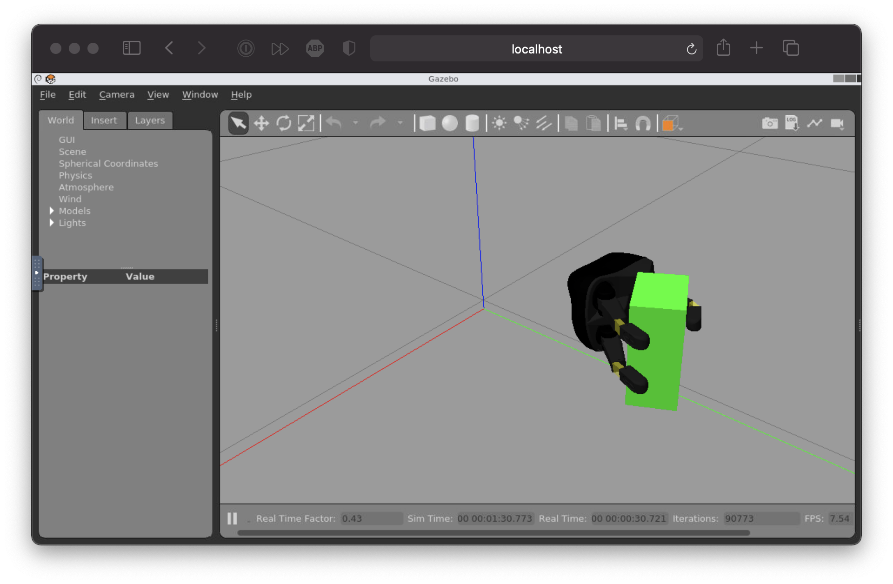

# The Role of Tactile Sensing in Learning and Deploying Grasp Refinement Algorithms


This is the official code repository for the publication "[The Role of Tactile Sensing in Learning and Deploying Grasp Refinement Algorithms](https://arxiv.org/abs/2109.11234)" which is currently under review.

## Citation

```bash
@misc{koenig2021tactile,
      title={The Role of Tactile Sensing in Learning and Deploying Grasp Refinement Algorithms}, 
      author={Alexander Koenig and Zixi Liu and Lucas Janson and Robert Howe},
      year={2021},
      eprint={2109.11234},
      archivePrefix={arXiv},
      primaryClass={cs.RO}
}
```

## Installation and Usage


___
<details>
<summary>Option 1 - Using plain Ubuntu</summary>

### Installation

0. Disclaimer: the below steps assume you have a fresh installation of Ubuntu 20.04.
1. Install ROS Noetic by following [these](http://wiki.ros.org/noetic/Installation/Ubuntu) steps.
2. Clone this repository into a new catkin workspace.
```bash 
# Init new catkin workspace
mkdir ~/catkin_ws/src -p
cd ~/catkin_ws/src
catkin_init_workspace
# Clone this repository with its submodules
git clone --recursive https://github.com/axkoenig/grasp_refinement.git
```
3. This paper uses the [Reflex Stack](https://github.com/axkoenig/reflex_stack), a software module that simulates the robotic hand and comes with various useful tools for real-time grasp analysis. The simulator runs Gazebo 11 and DART 6. To run Gazebo with the DART physics engine, you must build Gazebo from source. Running the shell script does this for you. 
```bash 
cd ~/catkin_ws/src/grasp_refinement/reflex_stack/shell
sudo ./install_gazebo_dart.sh
```
4. Now that you have all the required dependencies, you can build the software. 
```bash 
# Build software
cd ~/catkin_ws
catkin_make
# Source workspace and add to your bashrc
source ~/catkin_ws/devel/setup.bash
echo "source ~/catkin_ws/devel/setup.bash" >> ~/.bashrc
```
5. Check if everything works by firing up the [Reflex Stack](https://github.com/axkoenig/reflex_stack) simulator in a new terminal.
```bash 
roslaunch description reflex.launch run_keyboard_teleop_nodes:=true
```

### Train an Agent

You can train an agent with a one-liner. 

```bash
cd ~/catkin_ws/src/grasp_refinement/agent/src
python main.py --gui=1 --reward_framework=1 --contact_framework=1 --log_name=i_love_robots
```

### Enjoy a pre-trained Agent

Enjoy one of the pre-trained agents or one of the agents you trained yourself. 

```bash
python main.py --train=0 test_model_path=~/catkin_ws/src/grasp_refinement/trained_agents/epsilon+delta_full.zip --all_test_cases=0 --gui=1 --reward_framework=1 --contact_framework=1 --log_name=i_love_robots
```

</details>

___
<details>
<summary>Option 2 - Using Docker</summary>

### Installation
Clone this repository. 

```bash
git clone --recursive https://github.com/axkoenig/grasp_refinement.git
cd grasp_refinement
```

You have two options when working with Docker. (1) If you plan to make changes to the code and run your custom version, you need to build the Docker container yourself with the below command. (2) If you want to try this software out, you can get cracking right away with the pre-built [grasp_refinement Docker image](https://hub.docker.com/repository/docker/axkoenig/reflex_stack), and you don't need to run the below command and can continue with the next steps.

```bash
docker build -t axkoenig/grasp_refinement .
```

### Train an Agent

You can train an agent using the below command and view the training process in your browser. 

```bash
docker-compose up       # in the grasp_refinement directory
localhost:8080/vnc.html # type this in your browser
```

Run the below command if you don't want the visual output. 

```bash
docker-compose run grasp_refinement /bin/bash -c "source /home/catkin_ws/devel/setup.bash; python3 /home/catkin_ws/src/agent/src/main.py --output_dir=/home/.ros/log --gui=0 --log_name=i_love_robots"
```

### Enjoy a pre-trained Agent

Run this command to test a pre-trained agent.

```bash
docker-compose run grasp_refinement /bin/bash -c "source /home/catkin_ws/devel/setup.bash; python3 /home/catkin_ws/src/agent/src/main.py --output_dir=/home/.ros/log --train=0 --test_model_path=/home/catkin_ws/src/trained_agents/epsilon+delta_full --all_test_cases=0 --reward_framework=1 --contact_framework=1 --log_name=i_love_robots"
localhost:8080/vnc.html     # type this in your browser
```

You should now see the algorithm refining grasps in your browser.



</details>

___